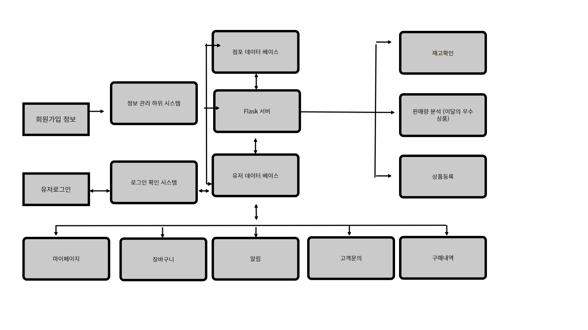

# [*경주 시장 로컬 배송 앱]

### 해당 서비스는 2024 경주 지역문제 해결 해커톤 [삼손할매]의 프로젝트 입니다.

---
## 서비스 소개
### [가온나]는 지역 상인과 소비자를 직접 연결하며, 신선한 재료 공급, 간편한 주문 및 결제, 효율적인 재고 관리를 지원하는 통합 플랫폼입니다.
  경주 지역 특화 결제 시스템과 피드백 기반 맞춤 서비스를 통해 지역 경제 활성화에 기여합니다.

  새벽 배송

1. 신선한 재료의 빠른 공급
오후 8시 이전 주문 시, 다음날 새벽(5시~6시경)에 신선한 재료를 빠르게 배송하여 상인과 소비자가 신선한 재료를 활용할 수 있습니다. 또한 빠른배송 이용 시 당일 모든 배송이 완료됩니다. 배송은 정해진 시간 11시 15시 19시에 일괄적으로 시작됩니다. 

2. 상인과 소비자 연결 강화
지역 내 상생
[가온나]는 지역 상인과 소비자들을 위한 맞춤형 서비스로, 소비자와 상인을 직접 연결해 배송하는 서비스를 제공합니다.
이를 통해 전통시장의 고유 문제인 직접 장을 보러 가고 와야한다는 불편함과 침채하고 있는 전통시장 문제를 해결하고 지역 경제 활성화와 지역 공동체의 상생을 도모합니다.

피드백 및 맞춤 서비스
상인들은 소비자들로부터 실시간 피드백을 받아, 이를 기반으로 품질과 서비스를 개선할 수 있습니다.
맞춤형 상품 추천 및 소비자 선호를 반영한 서비스 제공이 가능합니다.

3. 지역 상권 강화
다양한 결제 옵션
현금 및 카드 결제뿐 아니라, 모바일 결제 시스템(예: 경주페이)을 지원하여 거래를 간편하게 처리할 수 있습니다.
앱에 연동된 경주페이 사용 시, 사용 금액의 **30% 소득공제(전통시장 40%)**와 6~10% 캐시백 혜택을 제공합니다.
이를 통해 지역 상권의 경쟁력을 강화하고, 소비자 혜택을 극대화합니다.

4. 편리한 주문 시스템
간편한 주문
모바일 앱에서 손쉽게 다양한 제품을 검색하고 주문할 수 있습니다.

QR 스캐너 도입
QR 코드를 활용해 오프라인에서도 주문이 가능하며, 등록된 배달 주소와 연동해 간편한 거래를 지원합니다.

5. 효율적인 재고 관리
실시간 재고 확인
상인들은 실시간으로 재고를 확인하고, 부족하거나 과잉되지 않도록 관리할 수 있습니다.

6. 저렴한 수수료
상인 부담 완화
기존 유통망 대비 낮은 수수료 정책으로 상인들의 부담을 경감합니다.
가격 경쟁력 제공
낮은 수수료는 제품 가격 인하로 이어져 소비자에게 경제적 혜택을 제공합니다.

7. 광고 및 프로모션 기회 제공
상인들이 특별 할인 및 프로모션을 진행할 수 있는 플랫폼을 제공해, 신규 고객 유치 및 매출 증대에 기여합니다.
---
## 기능

- 회원 정보를 입력받은 정보를 GET 해서 Users.json에 저장함.
- 전화번호와 패스워드를 입력받고, Users.json에 있는지, 비교 후 있다면 200 신호를 보내고, 없다면 401신호를 보내줌.
- 메인 화면에서 식품의 카테고리를 선택할 수 있고, 선택시 상품과 점포가 뜸.
- 상품 선택시 장바구니로 옮겨짐 <- 방식은 구현 O, 미구현
- 장바구니에서 배송 시간 선택 <- 시간 이슈로 미구현
- 가게 찜하기(즐겨찾기) <- 시간 이슈로 미구현
- 점포 주인이 상품 등록하는 페이지 <- 시간 이슈로 미구현
- 문의사항을 메일로 받는 사이트 <- 주부의로 인해 날림

---
## 서비스 아키텍처(예시)

---
## 사용 기술(예시)
| **Category**         | **Technologies** |
|----------------------|-------------|
| **Frontend**         | html,css     |
| **Backend**          | flask,, js |
| **devops**           | localhost (ngrok)   |
| **Others**           | Github, Notion |

---
## 팀원 소개
|박지민         | 손준혁 | 이채민               |  윤해민 |
|----------------------|----------|-----------|---------|
| 팀장(Leader), 기획,디자인| 기획,발표 | Backend, Frontend| Backend,Frontend |
